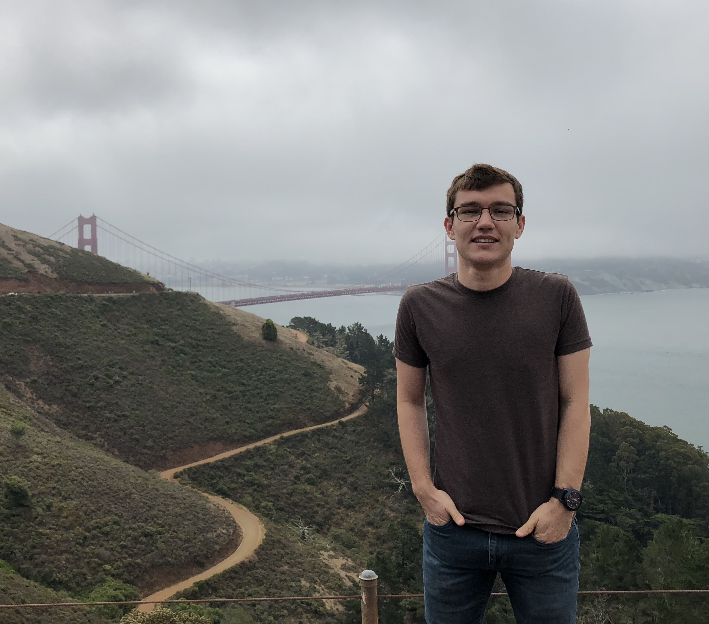

---
# Feel free to add content and custom Front Matter to this file.
# To modify the layout, see https://jekyllrb.com/docs/themes/#overriding-theme-defaults

layout: home
---

{:class="img-responsive" width="250px" style="float: left; margin-right: 18px;"}

I am a second-year Ph.D. student at University of California, San Diego - Computer Science and Engineering Department. My research interests span fault-tolerance and test methods safety-critical architectures, including deep neural network accelerators in automotive. I investigate various algorithm and system-level approaches to design low-cost safety solutions.

You can check my latest CV [here](./assets/elbruz_cv.pdf).
